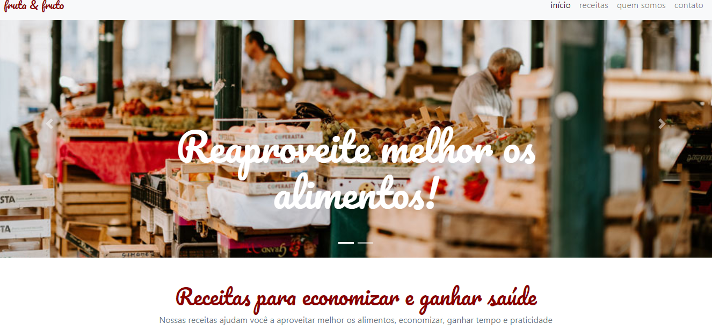

## Fruta e Fruto - Bootsrap

  

## Um pouco do Projeto:

➡ Landing page simples de uma página de receitas focada no reaproveitamento de alimentos e na sua saúde

➡ Site feito no curso de Bootsrap 4.0 da Alura com o intuito de ser apresentado a esse framework

## Conteúdos

- [Overview](#overview)
  - [Como rodar o projeto](#como-rodar-o-projeto)
  - [Como utilizar](#como-utilizar-o-projeto)
  - [Screenshot](#screenshot)
  - [Links](#links)
- [Processo](#processo)
  - [Contruido com](#construido-com)
  - [Tecnologia utilizadas](#tecnologias-utilizadas)
  - [O que eu aprendi](#oque-eu-aprendi)
  - [Continuação do desenvolvimento](#continuacao-do-desenvolvimento)
  - [Recursos úteis](#recursos-uteis)
- [Autor](#autor)

## Overview

### Como rodar o projeto

 1. Primeiramente é necessário ter o node js instalado(caso não tenha, apenas baixe a pasta zip do projeto) 
 2. Clone o projeto com `git clone https://github.com/glsvitoria/frutas-frutos-bootstrap`
 3. Após clonar o projeto, basta apenas abrir o html principal do site e utilizar as suas funcionalidades

### Como utilizar

 1. Se trata de uma landing page muito simples, então não possui muitas funcionalidades
 2. Ao clicar em contato no canto superior direito abre uma modal com um formulário para contato feito com o Bootstrap
 3. Possui um carrosel com 2 imagem trocando e posição e com seus títulos também feitos com o Bootstrap

### Screenshot

### Links
- Site hospedado: [Fruta e Fruto](https://glsvitoria.github.io/frutas-frutos-bootstrap/)

## Processo

### Tecnologias utilizadas:

### O que eu aprendi
- O uso do framework Bootstrap 4
- Como encontar na documentação do framework e utilizar elementos como carrosel, css-grid, nav-bar e outros elementos do css
- Facilidade que o Bootstrap pode trazer para o projeto com o uso a todo momento da sua documentação

### Continuação do desenvolvimento
- Continuar buscando outros estilos do Boostrap para usar no site
- Buscar mais informações de como usar versões mais recentes do framework

## Autor
- Linkedin - [Guilherme Vitória](https://www.linkedin.com/in/glsvitoria/)
- GitHub - [glsvitoria](https://github.com/glsvitoria)
- Instagram - [glsvitoria](https://www.instagram.com/glsvitoria/)
